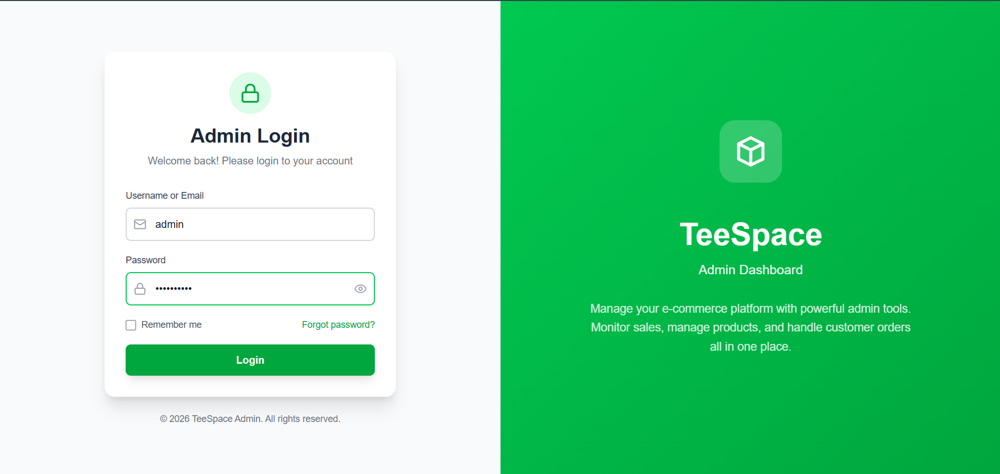
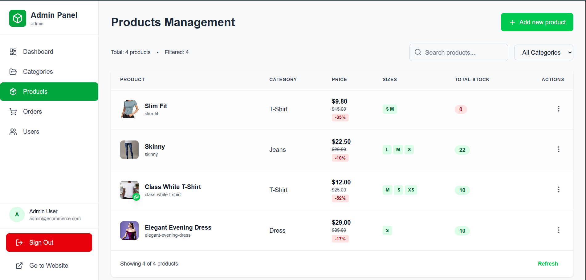
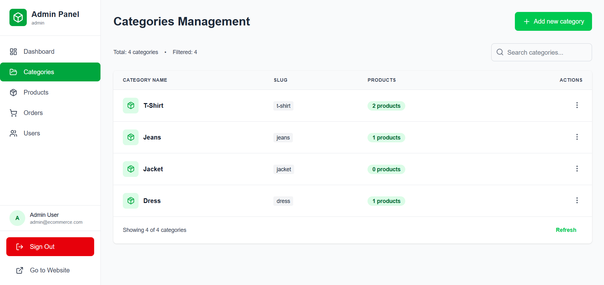
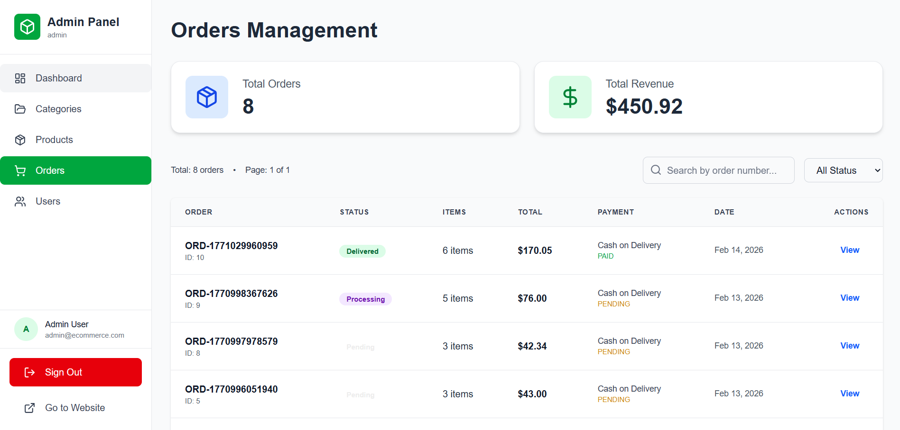
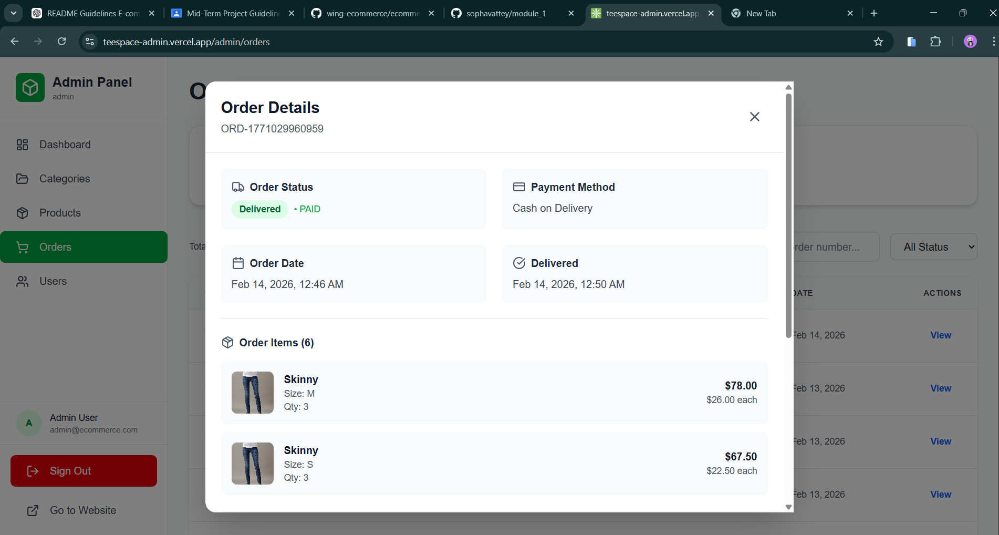
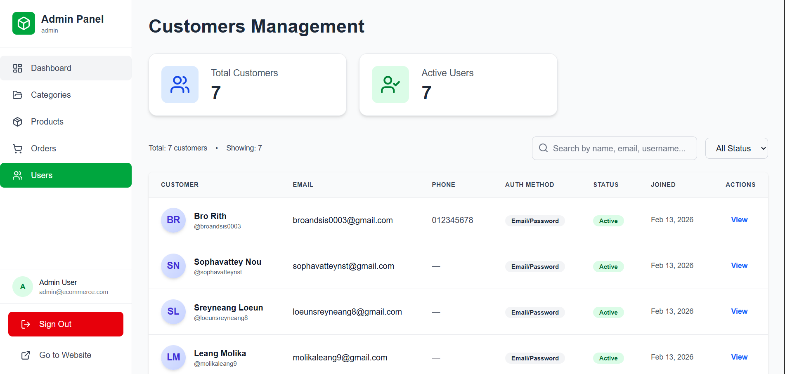
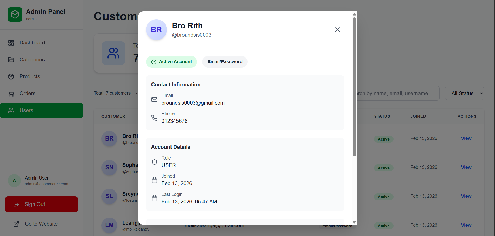
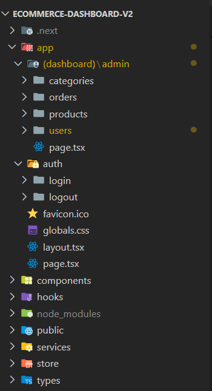

### TeeSpace Clothing Ecommerce Website: Admin Dashboard

- git repo:`https://github.com/wing-ecommerce/ecommerce-dashboard-v2`
- hosting: `https://teespace-admin.vercel.app/`

This dashboard allows administrators to:

- Manage products and category (Add, Delete, Update)
- Manage users (view user)
- View and manage orders (update order status)

Built with Next.js and connected to the Spring Boot backend API.

### Table of Contents

- [Setup](#setup)
- [Environment Variable](#environment-variable)
- [Features](#features)
- [Authentication \& Authorization](#authentication--authorization)
- [Tech Stack](#tech-stack)
- [Project Folder Structure](#project-folder-structure)
## Setup

- how to run local:
```
git clone https://github.com/wing-ecommerce/ecommerce-dashboard-v2
cd ecommerce-dashboard-v2
npm install
npm run dev
```

- run on: `http://localhost:4000`
  
## Environment Variable

```
NEXT_PUBLIC_API_URL=http://localhost:8080
```
## Features

1. Admin Login
   
   

- username: admin
- email: admin@ecommerce.com
- password: admin123!@

2. Manage products (Add, Delete, Update)
   
    
- Product body
```json

{
  "name": "Floral Summer Skirt",
  "slug": "floral-summer-skirt",
  "price": 45.00,
  "originalPrice": 65.00,
  "discount": 30,
  "image": "https://images.unsplash.com/photo-1583496661160-fb5886a0aaaa?w=500",
  "additionalPhotos": [],
  "description": "Lightweight floral print skirt perfect for summer days",
  "categoryId": "skirt",
  "sizes": [
    {
      "size": "S",
      "stock": 15,
      "sku": "floral-skirt-s"
    },
    {
      "size": "M",
      "stock": 20,
      "sku": "floral-skirt-m"
    },
    {
      "size": "L",
      "stock": 18,
      "sku": "floral-skirt-l"
    },
    {
      "size": "XL",
      "stock": 12,
      "sku": "floral-skirt-xl"
    }
  ]
}
```

3. Manage Category (Add, Delete, Update)
   
   

- Cateory Body

```json
{
  "name": "T-Shirt",
  "slug": "t-shirt"
}
```

4. Manage Order (Update order status)

    
    
5. Manage User (View User information who have USER role)
   
   
   

6. Security Features

- Protected routes
- Role validation on both frontend and backend
- Secure token handling (HttpOnly cookies)
- Backend API validation for every admin action

## Authentication & Authorization

The Admin Dashboard uses secure JWT authentication:

- Access Token (HttpOnly cookie)
- Refresh Token for session renewal
- Role-based access control (ADMIN role required)
- Only users with the ADMIN role can access this dashboard.

Unauthorized users are redirected to the login page.

* Process of Admin login

```
Admin (Email + Password)
            ↓
        Next.js (Login Form)
            ↓
      Spring Boot Backend
   - Verify password (BCrypt)
   - Check role = ADMIN
   - Generate JWT
            ↓
     Return JWT to Frontend
            ↓
   Access Admin Dashboard
```

## Tech Stack

- Next.js
- TypeScript
- Tailwind CSS
- Axios
- JWT Authentication
- Role-Based Access Control (RBAC)

## Project Folder Structure


```
admin-dashboard/
├── app/
│   ├── (auth)/
│   │   └── login/page.tsx
│   │
│   ├── dashboard/page.tsx
│   ├── products/page.tsx
│   ├── orders/page.tsx
│   ├── users/page.tsx
│   │
│   ├── layout.tsx
│   └── globals.css
│
├── components/
│   ├── ui/
│   ├── layout/          # sidebar, topbar
│   ├── tables/
│   └── forms/
│
├── services/
│   ├── api.ts
│   ├── auth.service.ts
│   ├── product.service.ts
│   ├── order.service.ts
│   └── user.service.ts
│
├── hooks/
│   └── useAuth.ts
│
├── store/
│   └── auth.store.ts
│
├── types/
│   ├── product.ts
│   ├── user.ts
│   └── order.ts
│
├── utils/
│   ├── constants.ts
│   └── helpers.ts
│
├── middleware.ts       # ADMIN ROLE CHECK HERE
├── .env.local
├── next.config.ts
└── package.json
```